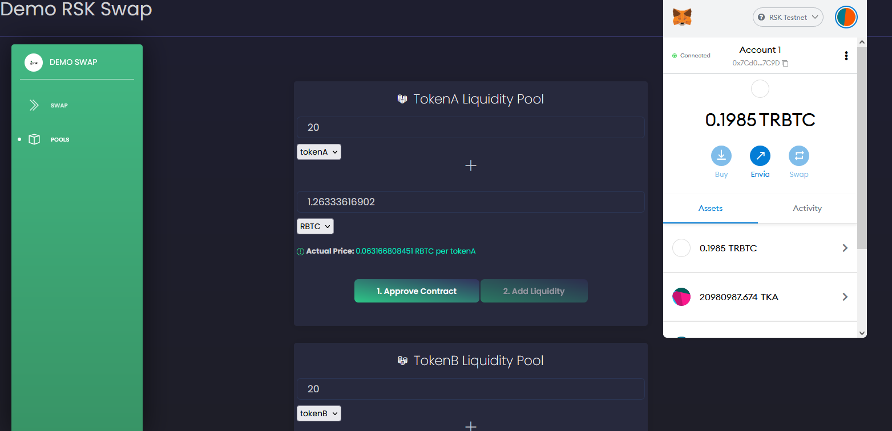
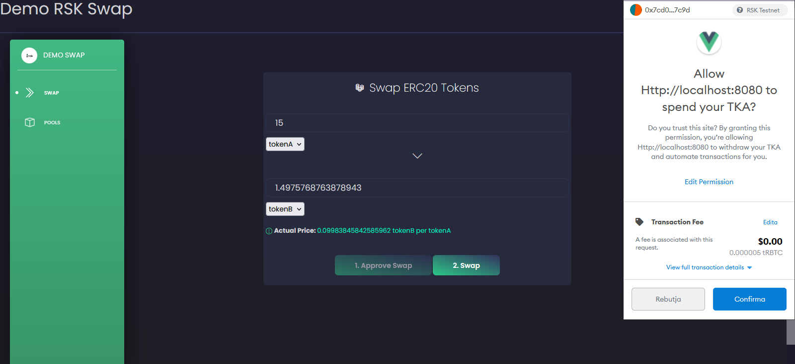

# Vue-RSK Swap Demo
   

This project is the practical part of a Computer Engineering final degree project related to the RSK Blockchain

The goal of the project was to deploy two ERC20 tokens in the RSK Testnet Network and develop a dApp that replicates the basic functionalities of a DEX (Decentralized Exchange) such as Add Liquidity and Swap tokens. 


## ERC20 tokens

  - tokenA ($TKA) [0xD92084733Aca1149E6F36275Cd79083Fb34a1370](https://explorer.testnet.rsk.co/address/0xd92084733aca1149e6f36275cd79083fb34a1370)
  - tokenB ($TKB) [0x093060F7787D740C0185C402d5c1B1a7a427f858](https://explorer.testnet.rsk.co/address/0x093060f7787d740c0185c402d5c1b1a7a427f858)


## Liquidity Pools

To add liquidity of a token, the user will provide the balance of the token he wants to add along with the equivalent amount of RBTC, the RSK blockchain native token. 

Depending on whether the user wants to add liquidity of the tokenA ($TKA) or the tokenB ($TKB), will use the TokensA Liquidity Pool or the TokenB Liquidity Pool. 


The user will first indicate the amount of the token pool that he wants to contribute along with the amount of equivalent value of the RBTC token. This RBTC equivalent value is automatically calculated when the user inputs the token amount, based on the tokenX/RBTC price relation.  

It will then be necessary to approve the expenditure of these tokens through the Metamask wallet so the Smart Contract can spend the user tokens and finally confirm the liquidity aggregation transaction. 



## Swap

Swap page




# Router Contract

This contract is deployed at [0xf55c496bb1058690DB1401c4b9C19F3f44374961](https://explorer.testnet.rsk.co/address/0xf55c496bb1058690db1401c4b9c19f3f44374961) and provides functions to manage and maintain liquidity pools and exchange between tokens deployed in the RSK network. 

## Install Dependencies

```shell
npm install
```

## Run Development Environment

```shell
npm run dev
```

### App running at:
  - Local:   http://localhost:8080/
  - Network: http://192.168.1.70:8080/


## File Structure
Within the download you'll find the following directories and files:

```
|-- Vue Black Dashboard

```


## Browser Support

    


## Licensing

- Copyright 2018 Creative Tim (https://www.creative-tim.com/)

- Licensed under MIT (https://github.com/creativetimofficial/vue-black-dashboard/issues/blob/master/LICENSE.md)


